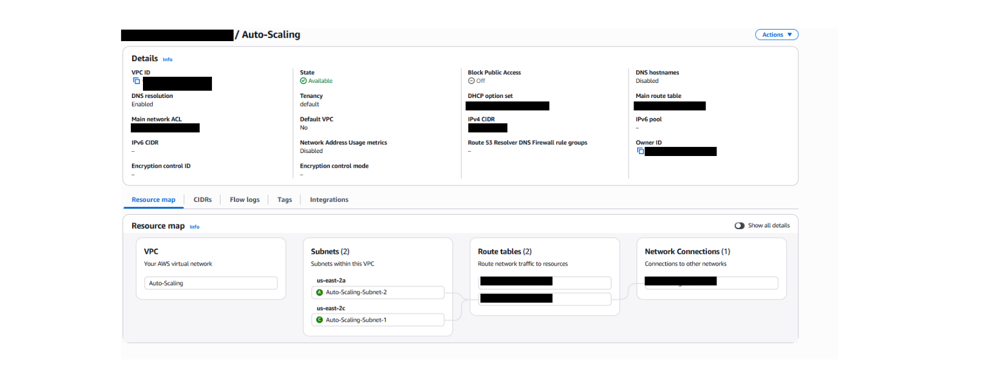
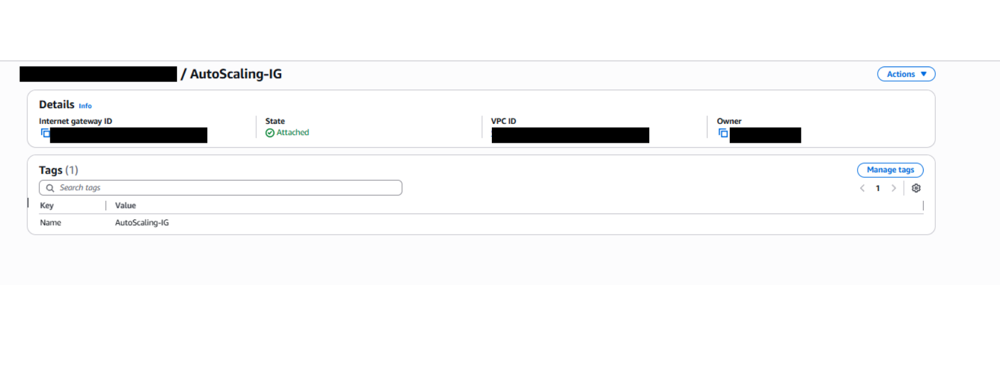
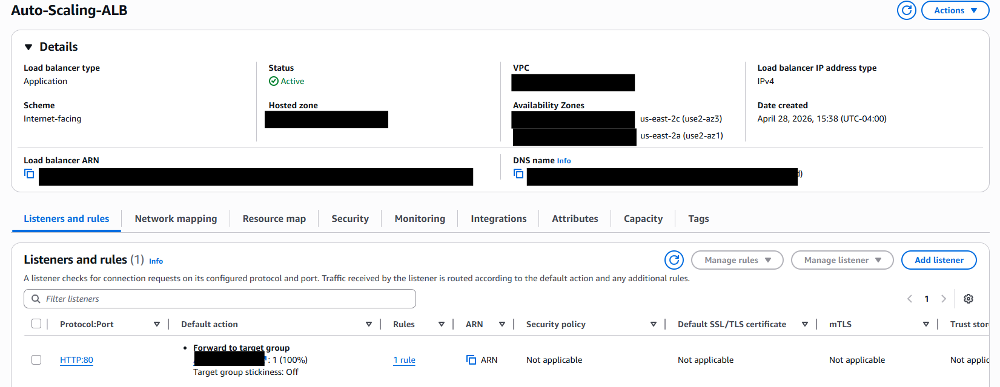

# AWS Auto Scaling Group Project

> A production-ready AWS architecture featuring an EC2 Auto Scaling Group, Application Load Balancer, CloudWatch monitoring, and defense-in-depth security.

---

## Project Goal

Build a secure and scalable AWS web architecture centered around an **EC2 Auto Scaling Group**. The objective was to handle changing traffic automatically, maintain high availability across multiple Availability Zones, and apply real-world cloud security best practices at every layer of the stack.

---

## Architecture Diagram


---

## What Each Component Does

| Component | Role |
|---|---|
| **Route 53** | DNS layer — routes users to the ALB via a domain name |
| **ACM (SSL/TLS)** | Provisions HTTPS certificates, enforcing encrypted transit |
| **Application Load Balancer** | Distributes traffic across EC2 instances; performs health checks |
| **VPC + Private Subnets** | Isolates EC2 instances from the internet, reducing attack surface |
| **Auto Scaling Group + EC2** | Automatically scales instances up/down based on demand |
| **CloudWatch + Alarms** | Monitors CPU metrics; triggers scale events via alarms |
| **IAM (Least Privilege)** | Custom scoped roles — each service only has what it needs |
| **SSM Session Manager** | Secure instance access without any open SSH ports |
| **Amazon S3** | Stores static assets, logs, and audit artifacts |
| **CloudFront** | CDN for static content delivery via global edge locations |

---

## Security Design

This architecture follows a **defense-in-depth** strategy:

- ✅ HTTPS enforced via ACM — all traffic encrypted in transit
- ✅ EC2 instances placed in **private subnets** — no direct internet access
- ✅ Security Groups and NACLs control all inbound/outbound traffic
- ✅ **No SSH ports open** — access only via SSM Session Manager
- ✅ Custom IAM roles with **strict least privilege** for every service

---

## IAM Policy (Custom Least Privilege)

The IAM policy was written from scratch with only the exact permissions needed:

```json
{
  "Version": "2012-10-17",
  "Statement": [
    {
      "Sid": "EC2Permissions",
      "Effect": "Allow",
      "Action": [
        "ec2:CreateLaunchTemplate", "ec2:DescribeLaunchTemplates",
        "ec2:ModifyLaunchTemplate", "ec2:RunInstances",
        "ec2:TerminateInstances", "ec2:DescribeInstances",
        "ec2:DescribeInstanceStatus", "ec2:CreateSecurityGroup",
        "ec2:AuthorizeSecurityGroupIngress", "ec2:DescribeSecurityGroups",
        "ec2:CreateTags", "ec2:DescribeTags"
      ],
      "Resource": "*"
    },
    {
      "Sid": "AutoScalingPermissions",
      "Effect": "Allow",
      "Action": [
        "autoscaling:CreateAutoScalingGroup",
        "autoscaling:UpdateAutoScalingGroup",
        "autoscaling:DescribeAutoScalingGroups"
      ],
      "Resource": "*"
    },
    {
      "Sid": "VPCNetworkingPermissions",
      "Effect": "Allow",
      "Action": [
        "ec2:CreateVpc", "ec2:DescribeVpcs", "ec2:CreateSubnet",
        "ec2:DescribeSubnets", "ec2:CreateInternetGateway",
        "ec2:AttachInternetGateway", "ec2:DescribeInternetGateways",
        "ec2:CreateRouteTable", "ec2:CreateRoute",
        "ec2:AssociateRouteTable", "ec2:DescribeRouteTables"
      ],
      "Resource": "*"
    },
    {
      "Sid": "LoadBalancingPermissions",
      "Effect": "Allow",
      "Action": [
        "elasticloadbalancing:CreateLoadBalancer",
        "elasticloadbalancing:DescribeLoadBalancers",
        "elasticloadbalancing:CreateListener",
        "elasticloadbalancing:DescribeListeners",
        "elasticloadbalancing:CreateTargetGroup",
        "elasticloadbalancing:RegisterTargets",
        "elasticloadbalancing:DescribeTargetGroups",
        "elasticloadbalancing:ModifyTargetGroup"
      ],
      "Resource": "*"
    },
    {
      "Sid": "RestrictedPassRole",
      "Effect": "Allow",
      "Action": "iam:PassRole",
      "Resource": "arn:aws:iam::*:role/EC2InstanceRole",
      "Condition": {
        "StringEquals": {
          "iam:PassedToService": ["ec2.amazonaws.com", "autoscaling.amazonaws.com"]
        }
      }
    }
  ]
}
```

---

## Screenshots

### VPC Configuration


### Internet Gateway


### Routing Table


### Subnets — AZ1 & AZ2
<div align="center">
  
  
</div>

### Application Load Balancer


---

## Video Demos

### Demo 1 — Auto Scaling in Action
Full walkthrough of the Auto Scaling Group triggering scale-out events during a CPU stress test, with CloudWatch alarms firing and new instances launching automatically.

📁 `Video Demo/Auto-Scaling.mp4`

### Demo 2 — Load Balancer Traffic Distribution
Demonstrates the ALB distributing HTTP requests across EC2 instances in both Availability Zones, confirming high availability and even traffic spread.

📁 `Video Demo/Load_Balancer.mp4`

---

## Project Log

| Date | Activity |
|---|---|
| 2026-04-27 | Created custom IAM policy with least privilege. Initialized GitHub repo. |
| 2026-04-28 | Built VPC, Security Groups, IGW, ALB, Target Group. Refined IAM policy. |
| 2026-04-29 | Created Launch Template, configured ALB, deployed Auto Scaling Group. |
| 2026-04-30 | ✅ Tested Auto Scaling. ✅ Configured SSM. Added CloudWatch alarms. |
| 2026-05-01–04 | Architecture review, diagram updates, and infrastructure refinement. |
| 2026-05-05 | ✅ Collected screenshots and videos. Edited demos and created script. |
| 2026-05-06 | ✅ Blurred screenshots. ✅ Wrote explanations. Finalized documentation. |

---

## Completed Tasks

- [x] Custom IAM Role with Least Privilege
- [x] VPC, Subnets, Internet Gateway & Route Tables
- [x] Application Load Balancer & Target Group
- [x] Launch Template & Auto Scaling Group
- [x] Auto Scaling Test (Scale-Out & Scale-In verified)
- [x] SSM Session Manager configured (No SSH)
- [x] CloudWatch Monitoring & Alarms
- [x] Architecture Diagram finalized
- [x] Screenshots & Video Demos collected
- [x] Portfolio page published
- [x] GitHub repository published

---

## What I Learned

- **Auto Scaling as Resilience** — Not just performance; a mechanism to keep services alive during failures and traffic spikes.
- **Defense-in-Depth** — Security must be built into every layer, not added as an afterthought.
- **Least Privilege IAM** — Writing a scoped policy from scratch reinforces how dangerous broad permissions are in production.
- **CLI Automation** — Using the AWS CLI made setup faster, consistent, and reproducible — the standard in real cloud engineering.

---

## Repository Structure

```
AWS-Auto-Scaling-Project/
├── Infastructure/
│   └── AutoScaling Diagram.png
├── Screenshots/
│   ├── VPC.png
│   ├── IGW.png
│   ├── Routing Table.png
│   ├── Subnet AZ 1.png
│   ├── Subnet AZ 2.png
│   └── ALB.png
├── Video Demo/
│   ├── Auto-Scaling.mp4
│   └── Load_Balancer.mp4
├── IAM Policy.txt
├── outline.md
├── Progress & Next Steps.md
└── README.md
```

---

*Built by [Zayan Parpia](https://github.com/ZayanParpia)*
